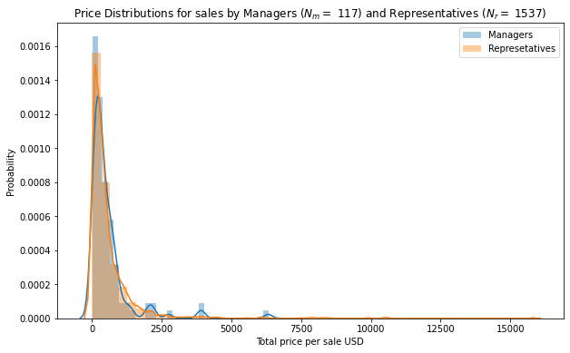

# Case Study - Hypothesis Testing

## Question 1: Is there a difference in quantity of products sold by discount rate?

View notebook [Here](notebooks/Question1.ipynb)

* Investigate Data
    * Obtain Necessary Data
    
* ANOVA Test
    * Defining H0, HA and alpha
    * ANOVA Assumptions
    * Perform statistical tests
* Conclusion

## Question 2: 

## Question 3: Is there a difference in mean sales between Sales Managers and Sales Representatives?

View notebook [Here](notebooks/Question2.ipynb)

To answer this question, we collected all products purchased from the `OrderDetail` table with their `UnitPrice`, `Quantity`, and `Discount`. For each row, we also joined on `OrderId` to obtain information about the sales employee associated with the order. Specifically, we collected `Employee Id` and `Title` from the `Employee` table.

Next, we computed the total cost of items represented in each row by discounting the unit price by the discount percentage and multiplying by the quantity. We then grouped on `OrderID` and summed over all products contained in the order to obtain an order total for each order in the data set. 

With the data adequately processed, we split the order totals into two samples based on the title of the responsible sales employee. With these samples in hand, we plan to use a Welch's t-test to check for a difference in means. We inspected the distributions of the price per sale and noted substantial right skew in the distributions, however both samples were large enough that the Central Limit Theorem insures sufficient normality in the sampling distributions of the sample means. 

### Conclusion
Based on the outcome of our t-test (p = 0.99), we fail to reject the null hypothesis that there is no difference in the mean sales for representatives and managers.

## Instructions
You are a DS working for Northwind, a supplier company.  Your job is find interesting relationships in their database.  They have tasked you with two questions. You'll find these in the notebooks. You are then tasked to dig into the data in a way that you find interesting.

* Answer the following questions using sampling distributions
* For each question
    * Setup a hypothesis test writing H0 and HA
    * Conduct test with a alpha of 0.05
    * Show distributions in a visualization
        * Use a legend to label distributions
    * Write a conclusion
    * If there is a difference in means
        * Use Cohen's D to measure the effect size
        * Conduct a Power Analysis
* Remember if you have multiple groups use ANOVA and Tukey Testing
* Work should be done in the `student.ipynb` file found in the `notebooks/` directory
* Create a custom README.md for your repo

## Database Schema

## Cause Memes

# Good luck!
